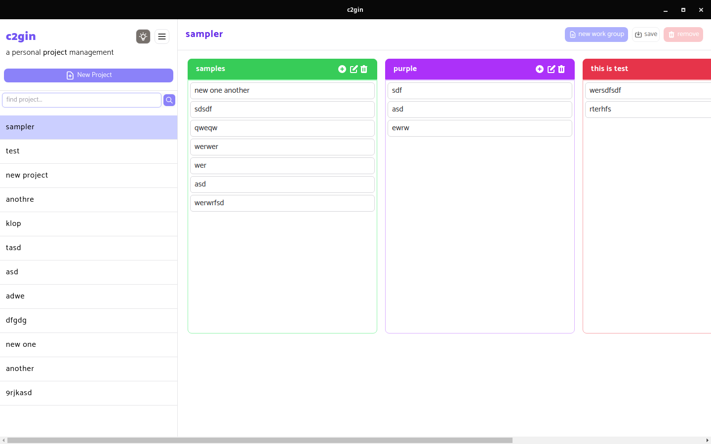
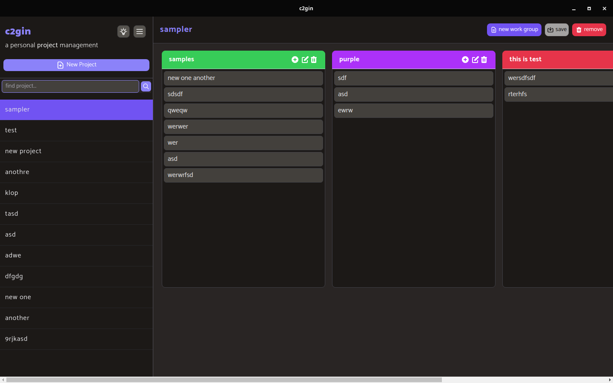

<div align="center">
  <a href="https://github.com/TheBoringDude/c2gin"></a>
  <br />
  <h1 style="color:#6366f1;font-weight:900;">c2gin</h1>
  <br />
  <p>a simple app for managing projects and collections</p>

<a href="https://github.com/TheBoringDude/c2gin/actions"></a>

</div>

<div><strong>LOGO:</strong> Icons made by <a href="https://www.freepik.com" title="Freepik">Freepik</a> from <a href="https://www.flaticon.com/" title="Flaticon">www.flaticon.com</a></div>

## Usage

### Screenshot

- Light
  

- Dark
  

### Implemented Shortcuts

- **`ctrl + p`** - triggers `New Project Modal`
- **`ctrl + alt + p`** - `New Work Group` (works only if there is a selected project)
- **`ctrl + s`** - save the selected project
- **`ctrl + d`** - remove the selected project
- **`ctrl + b`** - toggles the sidebar
- **`ctrl + f`** - shows the search input
- **`alt + {project_number}`** - select a current project from the sidebar (starts at 1)

## Build

```
yarn package
```

- If you want to build for multiple os. Try running the following.
  ```
  yarn package-all
  ```

## Development

- After installing all dependencies, start the development setup.

```
yarn start
```

### TODO:

- migrate to `@lowdb-v2`
- improve ui design
- make projects savable for future updates
- fix github automatic release publish `actions` (`electron-builder`)

### Primary Used Libraries

- electron
- react
- tailwindcss
- @heroicons/react
- @headlessui/react
- lowdb
- etc...

## Thanks

### Boilerplate Used: [electron-react-boilerplate](https://github.com/electron-react-boilerplate/electron-react-boilerplate)

- Setting Up **Tailwind**
  - https://rodpadev.medium.com/add-tailwind-css-to-the-popular-electron-react-boilerplate-erb-f1286b5b04f
